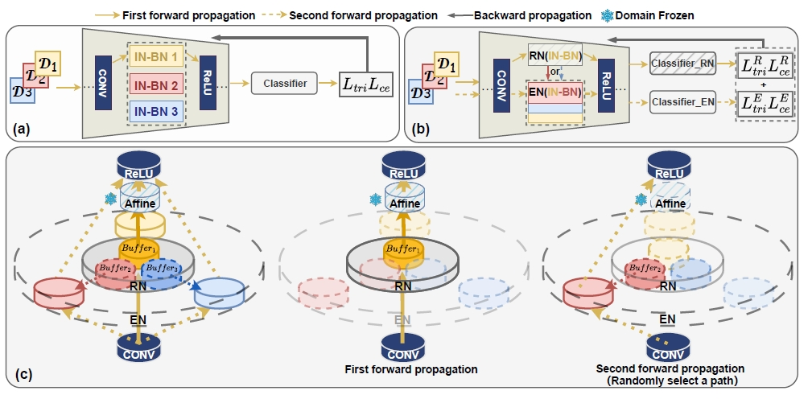

## Publications

<ol>

<li>
  

  
  
This is some text that will appear next to the image.

  

  
 <b>Rethinking Normalization Layers for Domain Generalizable Person Re-identification.</b> 
<b>Liang, Hao</b> and Zhou, Guanxing, and Tu, Xiaotong*, and Jakobsson, Andreas and Ding, Xinghao and Huang, Yue 
<i>Journal of Sound and Vibration (JSV)</i>, 2024  
<a href="https://doi.org/10.1016/j.jsv.2024.118620" class="textlink" target="_blank">[pdf]</a>
<a href="https://github.com/HauLiang/Acoustic-Beamforming-Advanced" class="textlink" target="_blank">[baseline]</a>
<a href="https://github.com/HauLiang/DAMAS-FISTA-Net" class="textlink" target="_blank">[codes]</a>

</li>

<li>
 <b>Adaptive Sparse Estimation of Nonlinear Chirp Signals using Laplace Priors</b> 
Tu, Xiaotong and <b>Liang, Hao*</b> and Jakobsson, Andreas and Huang, Yue and Ding, Xinghao 
<i>The Journal of the Acoustical Society of America (JASA)</i>, 2024  
<a href="https://doi.org/10.1121/10.0024248" class="textlink" target="_blank">[pdf]</a>
<a href="https://github.com/HauLiang/ANCME" class="textlink" target="_blank">[codes]</a>

</li>

<li>
 <b>Learning to Sound Imaging by a Model-based Interpretable Network</b> 
Zhang, Yonghua and Tu, Xiaotong* and Abbas, Saqlain and <b>Liang, Hao</b> and Huang, Yue and Ding, Xinghao 
<i>Signal Processing</i>, 2023  
<a href="https://www.sciencedirect.com/science/article/pii/S0165168423003559" class="textlink" target="_blank">[pdf]</a>

</li>

<li>
 <b>Adaptive Nonlinear Group Delay Mode Estimation</b> 
Mao, Yijin and Tu, Xiaotong* and Abbas, Saqlain and <b>Liang, Hao</b> and Huang, Yue and Ding, Xinghao 
<i>Signal Processing</i>, 2023  
<a href="https://www.sciencedirect.com/science/article/pii/S0165168423002554" class="textlink" target="_blank">[pdf]</a>
<a href="https://github.com/YijinMao/ANGDME" class="textlink" target="_blank">[codes]</a>

</li>

<li>
 <b>Sparse Optimization for Nonlinear Group Delay Mode Estimation</b> 
<b>Liang, Hao</b> and Ding, Xinghao and Jakobsson, Andreas and Tu, Xiaotong* and Huang, Yue 
<i>The Journal of the Acoustical Society of America (JASA)</i>, 2022  
<a href="https://doi.org/10.1121/10.0014696" class="textlink" target="_blank">[pdf]</a>
<a href="https://github.com/HauLiang/NGDME" class="textlink" target="_blank">[codes]</a>

</li>

<li>
 <b>A Robust Low-Rank Matrix Completion Based on Truncated Nuclear Norm and Lp-norm</b> 
<b>Liang, Hao</b> and Li, Kang* and Huang, Jianjun 
<i>The Journal of Supercomputing</i>, 2022  
<a href="https://doi.org/10.1007/s11227-022-04385-8" class="textlink" target="_blank">[pdf]</a>
<a href="https://github.com/HauLiang/Lp-TNN" class="textlink" target="_blank">[codes]</a>

</li>

<li>
 <b>High-Resolution Source Localization Exploiting the Sparsity of the Beamforming Map</b> 
Ding, Xinghao and <b>Liang, Hao</b> and Jakobsson, Andreas and Tu, Xiaotong* and Huang, Yue 
<i>Signal Processing</i>, 2022  
<a href="https://www.sciencedirect.com/science/article/pii/S016516842100414X" class="textlink" target="_blank">[pdf]</a>
<a href="https://github.com/HauLiang/FFT-DFISTA-and-FFT-DADMM" class="textlink" target="_blank">[codes]</a>

</li>

</ol>
